# Architecture Review Report

**Project:** rfq_simulator
**Date:** 2026-03-01
**Files reviewed:** 32 Python source files across 5 modules + tests
**Overall health:** 🟢 Strong

## Codebase Summary

The RFQ Simulator is a Monte Carlo simulation engine for corporate bond market-making via Request-for-Quote protocols. It models a dealer who uses an alpha signal to optimally price quotes against a pool of simulated competitors. The architecture is a clean 4-layer design: `world/` (exogenous market processes), `agent/` (strategy decisions), `core/` (state and P&L accounting), `simulation/` (event loop and batch runs), and `output/` (diagnostics and visualization). Entry points are `run_simulation()`, `run_batch()`, and the Jupyter notebook. Configuration is centralised in a single `SimConfig` dataclass. All 106 tests pass.

## Scorecard

| Dimension | Score | Key Finding |
|---|---|---|
| Boundary Quality | 🟢 Strong | Clean domain-aligned separation; modules have clear single responsibilities |
| Dependency Direction | 🟡 Adequate | Generally correct DAG; two minor violations (circular and upward imports) |
| Abstraction Fitness | 🟢 Strong | Appropriate use of dataclasses, functions, and one protocol |
| DRY & Knowledge | 🟡 Adequate | bps-to-dollars conversion duplicated across 5+ modules |
| Extensibility | 🟡 Adequate | Adding new world processes is clean; new strategy types would require more work |
| Testability | 🟢 Strong | Pure functions dominate; 106 tests pass; no I/O mocking needed |
| Parallelisation | 🟡 Adequate | Batch runner has parallel stub but not implemented; event loop is inherently sequential |

**Overall: 🟢 Strong — well-structured simulator with minor structural improvements possible. Architecture is sound for current scope.**

## Dependency Graph

```mermaid
graph TD
    config["config.py (SimConfig)"]

    subgraph world["world/"]
        clock["clock.py"]
        price["price.py"]
        regime["regime.py"]
        rfq_stream["rfq_stream.py"]
        hawkes["hawkes.py"]
        imbalance["imbalance.py"]
        spread["spread.py"]
        competitors["competitors.py"]
        street_lean["street_lean.py"]
    end

    subgraph agent["agent/"]
        alpha["alpha.py"]
        target["target.py"]
        observable["observable.py"]
        lean["lean.py"]
        winrate["winrate.py"]
        quoting["quoting.py"]
        exit["exit.py"]
    end

    subgraph core["core/"]
        state["state.py"]
        accounting["accounting.py"]
        protocols["protocols.py"]
    end

    subgraph simulation["simulation/"]
        event_loop["event_loop.py"]
        baseline["baseline.py"]
        batch["batch.py"]
    end

    subgraph output["output/"]
        diagnostics["diagnostics.py"]
        realistic_diag["realistic_diagnostics.py"]
        narrative["narrative.py"]
    end

    %% Config is the root dependency
    clock --> config
    price --> config
    price --> clock
    regime --> config
    rfq_stream --> config
    rfq_stream --> clock
    rfq_stream --> hawkes
    rfq_stream --> imbalance
    rfq_stream --> regime
    hawkes --> config
    hawkes --> clock
    hawkes -.->|"⚠️ deferred import"| rfq_stream
    imbalance --> config
    imbalance --> regime
    spread --> config
    spread --> regime
    competitors --> config
    competitors --> regime
    competitors --> rfq_stream
    competitors --> spread
    street_lean --> config
    street_lean --> clock

    alpha --> config
    alpha --> clock
    alpha --> regime
    target --> config
    observable --> config
    observable --> clock
    lean --> config
    winrate --> config
    winrate --> rfq_stream
    quoting --> config
    quoting --> rfq_stream
    quoting --> winrate
    quoting --> target
    exit --> config

    state --> config
    state --> regime
    state -.->|"⚠️ imports RFQEvent"| rfq_stream
    accounting --> config

    event_loop --> config
    event_loop --> world
    event_loop --> agent
    event_loop --> core

    baseline --> config
    baseline --> clock
    baseline --> regime
    baseline --> alpha
    baseline --> target
    baseline --> accounting

    batch --> config
    batch --> event_loop
    batch --> baseline

    realistic_diag --> narrative
    realistic_diag -.->|"⚠️ imports from world"| spread
    realistic_diag -.->|"⚠️ imports from world"| regime
```

## Detailed Findings

### AR-DEP-001: Hawkes ↔ rfq_stream circular dependency (deferred import)
- **Finding ID:** AR-DEP-001
- **Dimension:** Dependency Direction
- **Severity:** 🟡
- **Location:** `world/hawkes.py:86`, `world/rfq_stream.py:27`
- **Principle violated:** DAG constraint (circular import)
- **Evidence:** `hawkes.py` uses `from .rfq_stream import compute_intraday_intensity` inside a function body (deferred) to avoid circular import. `rfq_stream.py` imports from `hawkes.py` at module level.
- **Impact:** The deferred import is a code smell indicating the intraday intensity function is in the wrong module. It works but creates a hidden coupling that would break if someone restructured imports.
- **Recommendation:** Extract `compute_intraday_intensity()` to `clock.py` or a new `seasonality.py` module, since it's a time-grid utility used by both arrival processes. Both `rfq_stream.py` and `hawkes.py` would then import from this shared utility without circularity.

### AR-DEP-002: core/state.py imports from world/rfq_stream.py
- **Finding ID:** AR-DEP-002
- **Dimension:** Dependency Direction
- **Severity:** 🟡
- **Location:** `core/state.py:20`
- **Principle violated:** Dependency Inversion (core depends on world)
- **Evidence:** `state.py` imports `RFQEvent` from `world/rfq_stream.py` for the `RFQLog` dataclass type annotation. This means `core/` depends on `world/`, whereas ideally core should be dependency-free (only depending on config).
- **Impact:** Minor — `RFQEvent` is a pure dataclass with no behaviour, so the coupling is shallow. But it means `core/` cannot be tested or understood without `world/`.
- **Recommendation:** Move `RFQEvent` to `core/` (it's a domain-level data structure) or define a Protocol for the fields `RFQLog` actually uses. Alternatively, accept this as a pragmatic choice since the coupling is purely structural.

### AR-DRY-001: bps-to-dollars conversion duplicated
- **Finding ID:** AR-DRY-001
- **Dimension:** DRY & Knowledge Duplication
- **Severity:** 🟡
- **Location:** `agent/quoting.py:177`, `agent/lean.py:196`, `agent/observable.py:53-54`, `world/competitors.py:253`, `world/street_lean.py:171`, `core/accounting.py:129-130`, `agent/exit.py:195-201`
- **Principle violated:** Knowledge duplication (same formula repeated)
- **Evidence:** The pattern `X_bps / 10000.0 * cfg.p0` (and its variants with `* cfg.lot_size_mm * 10000`) appears in 7+ locations. Each independently converts between bps and dollar terms using the same formula.
- **Impact:** If the conversion logic changes (e.g., price basis changes, or lot size convention changes), every instance must be updated. Divergence risk is moderate.
- **Recommendation:** Add conversion helpers to `SimConfig` or a small `units.py` utility: `cfg.bps_to_dollars(bps)`, `cfg.dollars_to_bps(dollars)`, `cfg.notional_per_lot`. This centralises the conversion logic.

### AR-EXT-001: Adding a new strategy type requires modifying event_loop.py
- **Finding ID:** AR-EXT-001
- **Dimension:** Extensibility
- **Severity:** 🟡
- **Location:** `simulation/event_loop.py` (entire file)
- **Principle violated:** Open/Closed (partially)
- **Evidence:** The event loop hardcodes the strategy flow: compute alpha → compute target → compute lean → compute quote → simulate competition. Adding a new strategy (e.g., passive-only, momentum-based, or multi-asset) would require modifying the core loop or duplicating it.
- **Impact:** Currently there's one strategy, so this is not a problem. It becomes one only if multiple strategies need comparison beyond the baseline.
- **Recommendation:** Not urgent. If a second strategy emerges, extract the decision logic into a `Strategy` protocol with methods like `on_rfq(rfq, state) -> QuoteResult`. The event loop would call the strategy interface rather than hard-coding agent functions.

### AR-PAR-001: Batch runner parallel mode not implemented
- **Finding ID:** AR-PAR-001
- **Dimension:** Parallelisation
- **Severity:** 🟡
- **Location:** `simulation/batch.py:126`
- **Principle violated:** Incomplete feature
- **Evidence:** `run_batch()` accepts `parallel=True` but raises `NotImplementedError`. The design imports `ProcessPoolExecutor` and `as_completed` but never uses them.
- **Impact:** For 500 Monte Carlo paths at ~1 second each, sequential execution takes ~8 minutes. Parallelisation would bring this to ~2 minutes on 4 cores. Not blocking but a clear missed opportunity.
- **Recommendation:** Implement the parallel path. The simulation is embarrassingly parallel since each path uses an independent seed and produces an independent `SimulationResult`. The main consideration is that `run_simulation` must be picklable (which it is, since it only uses numpy/dataclasses).

### AR-BND-001: ExitMode enum defined in two places
- **Finding ID:** AR-BND-001
- **Dimension:** Boundary Quality
- **Severity:** 🟡
- **Location:** `core/state.py:23-27`, `agent/exit.py:28-32`
- **Principle violated:** Single source of truth
- **Evidence:** `ExitMode` is defined as an `Enum` in both `core/state.py` and `agent/exit.py` with identical values (`PATIENT`, `AGGRESSIVE`). The event loop imports from `core/state.py` (line 32), but the `HybridExitManager` uses its own copy from `agent/exit.py`.
- **Impact:** If someone adds a new exit mode to one but not the other, subtle bugs emerge. The duplication is easy to miss.
- **Recommendation:** Define `ExitMode` in exactly one place (`core/state.py` since it's a state concept) and import it everywhere.

### AR-ABS-001: StochasticProcess protocol is defined but inconsistently adopted
- **Finding ID:** AR-ABS-001
- **Dimension:** Abstraction Fitness
- **Severity:** 🟡
- **Location:** `core/protocols.py`, `world/hawkes.py`, `world/imbalance.py`, `world/street_lean.py`, `world/regime.py`
- **Principle violated:** Incomplete interface adoption
- **Evidence:** `StochasticProcess` protocol defines `step()`, `reset()`, and `value` property. Four classes implement it (`HawkesProcess`, `ImbalanceProcess`, `StreetLeanProcess`, `RegimeProcess`), but the event loop never uses them through the protocol — it calls `generate_*_path()` free functions and array indexing instead. The OOP process classes exist alongside procedural generation functions, creating two parallel APIs for the same concepts.
- **Impact:** The protocol is unused at runtime. The process classes appear to have been added for the diagnostic framework but aren't integrated into the main simulation. This creates confusion about which API is canonical.
- **Recommendation:** Either commit to the protocol (use process objects in the event loop instead of pre-generated arrays) or remove the protocol and process classes to avoid maintaining two parallel interfaces. Given the simulator's batch-generation-then-iterate design, the procedural approach is more natural and the protocol may be premature.

## Positive Highlights

1. **Clean world/agent separation.** The division between exogenous market processes (`world/`) and endogenous strategy decisions (`agent/`) mirrors the standard decomposition in quantitative finance and is well-executed. Modules are named after domain concepts, not technical roles.

2. **Configuration centralisation.** All ~80 parameters live in a single `SimConfig` dataclass with doc-referenced defaults. Every module takes `cfg: SimConfig` rather than raw parameters. This makes parameter sweeps trivial and prevents configuration scatter.

3. **Strong testability through pure functions.** Most logic is in pure functions that take arrays and configs and return results. No file I/O, no global state, no singletons. The test suite (106 tests) runs in ~70 seconds with zero mocks required.

4. **Detailed RFQ logging.** Every RFQ event records full context (true price, observable price, lean, theo, quote details, competition result, fill outcome). This makes post-simulation analysis and debugging straightforward without needing to replay.

## Recommended Review Cadence

Re-run this review when:
- A second strategy type is added (triggers AR-EXT-001)
- The event loop is significantly restructured
- The batch runner gets parallelisation (triggers AR-PAR-001 resolution)

---

## Handoff

| Dimension | Score | Key Finding |
|---|---|---|
| Boundary Quality | 🟢 | Clean domain-aligned separation; ExitMode duplication is minor |
| Dependency Direction | 🟡 | Circular import in hawkes↔rfq_stream; core depends on world (state→RFQEvent) |
| Abstraction Fitness | 🟢 | StochasticProcess protocol defined but unused; appropriate use of dataclasses elsewhere |
| DRY & Knowledge | 🟡 | bps-to-dollars conversion repeated in 7+ locations |
| Extensibility | 🟡 | Adding new strategy types requires modifying the event loop |
| Testability | 🟢 | Pure functions, no mocking needed, 106 tests pass |
| Parallelisation | 🟡 | Batch parallel mode accepted but raises NotImplementedError |

### Findings Summary

| Finding ID | Severity | Dimension | Location | Summary |
|---|---|---|---|---|
| AR-DEP-001 | 🟡 | Dependencies | `world/hawkes.py:86` | Deferred import from rfq_stream creates hidden circular dependency. Extract `compute_intraday_intensity` to shared utility. |
| AR-DEP-002 | 🟡 | Dependencies | `core/state.py:20` | core/ imports RFQEvent from world/, inverting the expected dependency direction. Coupling is shallow (dataclass only). |
| AR-DRY-001 | 🟡 | DRY | 7+ files | bps-to-dollars conversion `X / 10000 * p0` duplicated across agent, world, and core modules. Centralise in config helpers. |
| AR-EXT-001 | 🟡 | Extensibility | `simulation/event_loop.py` | Event loop hardcodes one strategy flow. Adding a second strategy type would require modifying or duplicating the loop. |
| AR-PAR-001 | 🟡 | Parallelisation | `simulation/batch.py:126` | Parallel execution stub raises NotImplementedError. Sequential MC is ~4x slower than necessary. |
| AR-BND-001 | 🟡 | Boundaries | `core/state.py:23`, `agent/exit.py:28` | ExitMode enum defined identically in two modules. Single-source-of-truth violation. |
| AR-ABS-001 | 🟡 | Abstraction | `core/protocols.py`, 4 process classes | StochasticProcess protocol defined and implemented by 4 classes but never used through the protocol interface. Two parallel APIs exist. |
