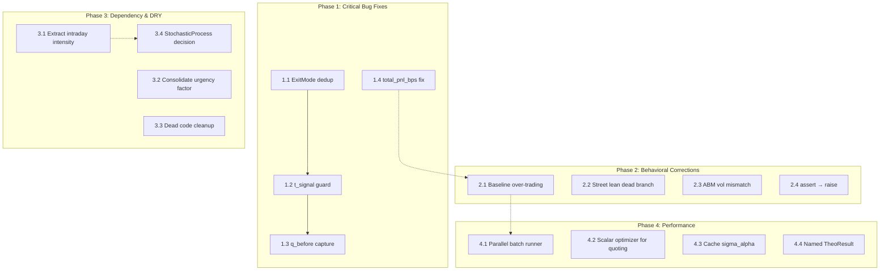
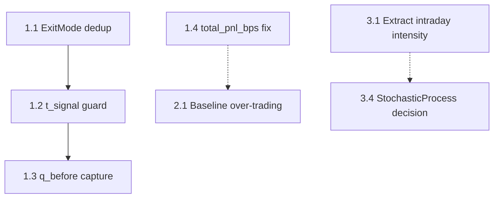

# Refactoring Roadmap

**Project:** rfq_simulator
**Date:** 2026-03-01
**Findings consolidated:** 25 (7 architecture + 18 code review → 23 after dedup)

## Executive Summary

The rfq_simulator architecture is sound (🟢 Strong) but carries 1 critical bug (ExitMode import shadowing), 5 major correctness issues (always-true guard, fragile state reconstruction, incorrect PnL normalisation, baseline over-trading, dead directional logic), and structural debt (circular dependency, duplicated code, unused protocol). The target state is: all correctness bugs fixed, dependency graph cleaned, and performance bottlenecks addressed — in 4 phases that each leave the system fully working with all tests passing.

## Scorecard (Baseline)

| Dimension | Score | Key Finding |
|---|---|---|
| Boundary Quality | 🟢 | Clean domain-aligned separation; ExitMode duplication is minor |
| Dependency Direction | 🟡 | Circular import in hawkes↔rfq_stream; core depends on world |
| Abstraction Fitness | 🟢 | StochasticProcess protocol defined but unused |
| DRY & Knowledge | 🟡 | bps-to-dollars conversion repeated in 7+ locations |
| Extensibility | 🟡 | Adding new strategy types requires modifying event loop |
| Testability | 🟢 | Pure functions, no mocking needed, 106 tests pass |
| Parallelisation | 🟡 | Batch parallel mode accepted but raises NotImplementedError |

## Consolidated Findings

| # | Finding ID(s) | Finding | Source | Severity | Impact | Scope | Risk | Priority |
|---|---|---|---|---|---|---|---|---|
| 1 | AR-BND-001 + CR-BUG-001 | ExitMode duplication; import shadowing in event_loop | Both | 🔴 Critical | 5 | 2 | 1 | **7** |
| 2 | CR-BUG-002 | `t_signal is not None` guard always True | CR | 🟠 Major | 4 | 1 | 2 | **5** |
| 3 | CR-BUG-004 | `q_before` reconstructed from post-update state | CR | 🟠 Major | 4 | 1 | 2 | **5** |
| 4 | CR-BUG-010 | `total_pnl_bps` normalisation incorrect | CR | 🟠 Major | 4 | 1 | 2 | **5** |
| 5 | CR-BUG-012 | Baseline trades every price step; inflated costs | CR | 🟠 Major | 4 | 1 | 3 | **4** |
| 6 | AR-PAR-001 | Parallel batch runner not implemented | AR | 🟡 | 3 | 1 | 2 | **3** |
| 7 | CR-PERF-009 | Grid search ~601 points; scalar optimiser viable | CR | 🔵 Suggestion | 3 | 1 | 2 | **3** |
| 8 | CR-BUG-003 | `compute_street_lean_impact` identical branches | CR | 🟠 Major | 2 | 1 | 1 | **2** |
| 9 | CR-STYLE-018 | `assert` in `validate()` stripped by `-O` | CR | 🟡 Minor | 2 | 1 | 1 | **2** |
| 10 | AR-DEP-001 | Hawkes ↔ rfq_stream circular dependency | AR | 🟡 | 3 | 2 | 2 | **2** |
| 11 | CR-PERF-015 | `_estimate_sigma_alpha` recomputes on every refresh | CR | 🔵 Suggestion | 2 | 1 | 1 | **2** |
| 12 | CR-DRY-008 | Urgency factor duplicated with subtle differences | CR | 🟡 Minor | 2 | 2 | 1 | **1** |
| 13 | CR-STYLE-017 | Log returns used for ABM realised vol | CR | 🟡 Minor | 2 | 1 | 2 | **1** |
| 14 | AR-DRY-001 | bps-to-dollars conversion duplicated in 7+ files | AR | 🟡 | 3 | 4 | 2 | **0** |
| 15 | CR-STYLE-006 + CR-STYLE-011 | Unused import `Callable`; unused `is_client_buy` param | CR | 🟡 Minor | 1 | 1 | 1 | **0** |
| 16 | CR-TYPE-016 | `compute_theo_price` returns bare `tuple` | CR | 🔵 Suggestion | 1 | 1 | 1 | **0** |
| 17 | AR-DEP-002 | core/state.py imports RFQEvent from world | AR | 🟡 | 2 | 2 | 2 | **0** |
| 18 | AR-ABS-001 + CR-SOLID-014 | StochasticProcess protocol unused; signature mismatch | Both | 🟡 | 2 | 3 | 2 | **-1** |
| 19 | CR-DRY-007 | TimeGrid delegates 5 properties without logic | CR | 🔵 Suggestion | 1 | 2 | 1 | **-1** |
| 20 | AR-EXT-001 | Event loop hardcodes one strategy flow | AR | 🟡 | 2 | 3 | 3 | **-2** |
| 21 | CR-STYLE-005 + CR-STYLE-013 | Legacy typing imports; IntEnum vs Enum style | CR | 🟡 Minor | 1 | 5 | 1 | **-4** |

### Load-Bearing Fixes (Pareto 20%)

Three fixes yield ~80% of the structural improvement:

1. **ExitMode dedup (#1)** — eliminates the only 🔴 finding and resolves the AR-BND-001 boundary violation. Cascades: unblocks the enum style consistency fix.
2. **Event loop correctness cluster (#2, #3)** — fixing `t_signal` guard and `q_before` reconstruction removes two latent logic errors in the core simulation loop. These are the highest-risk code paths.
3. **Baseline over-trading (#5)** — the baseline is the benchmark against which the LP strategy is measured. If it's unrealistically expensive, all relative P&L numbers are inflated.

## Dependency Graph

## Parallel Tracks

| Track | Steps | Theme | Can start immediately? |
|---|---|---|---|
| A | 1.1 → 1.2 → 1.3 | Event loop correctness | Yes |
| B | 1.4 → 2.1 | P&L and baseline correctness | Yes |
| C | 2.2, 2.3, 2.4 | Isolated behavioural fixes | After Phase 1 |
| D | 3.1 → 3.2 → 3.3 → 3.4 | Structural cleanup | After Phase 1 |
| E | 4.1, 4.2, 4.3, 4.4 | Performance & polish | After Phase 2 |

---

## Phase 1: Critical Bug Fixes
**Target:** All 🔴 and 🟠 correctness bugs in the event loop and core accounting are fixed. No logic errors remain in the hot path.
**Effort:** single-module scope per step; low-to-medium risk

### Step 1.1: Consolidate ExitMode to single definition

**Finding IDs:** AR-BND-001, CR-BUG-001
**Priority score:** 7
**Scope:** multi-module
**Risk level:** low

**What changes:**
- Delete the `ExitMode` class from `agent/exit.py` (lines 28-33)
- Add `from ..core.state import ExitMode` to `agent/exit.py`
- In `simulation/event_loop.py`, remove `ExitMode` from the `agent.exit` import line (line 26); keep the import from `core.state` (line 32)
- Verify `HybridExitManager` in `agent/exit.py` works with the imported `ExitMode`

**What doesn't change:**
- `ExitMode` values remain `PATIENT = "patient"`, `AGGRESSIVE = "aggressive"`
- `HybridExitManager` API and behaviour
- `SimulationState` dataclass
- All event loop logic

**Verification:**
- [ ] All 106 existing tests pass
- [ ] `grep -r "class ExitMode" src/` returns exactly 1 result (in `core/state.py`)
- [ ] `python3 -c "from rfq_simulator.agent.exit import HybridExitManager, ExitMode; print(ExitMode.PATIENT)"` succeeds

**Depends on:** none
**Blocks:** 1.2

**Rollback:** `git checkout -- src/rfq_simulator/agent/exit.py src/rfq_simulator/simulation/event_loop.py`

---

### Step 1.2: Fix t_signal guard in event loop

**Finding IDs:** CR-BUG-002
**Priority score:** 5
**Scope:** single-function
**Risk level:** medium

**What changes:**
- In `simulation/event_loop.py` (line ~206), replace:
  `if state.t_signal is not None and alpha_manager.should_refresh(current_minute):`
  with a guard that checks whether a signal has actually been generated (e.g., `if alpha_manager.current_signal is not None and alpha_manager.should_refresh(current_minute):`)
- Verify `AlphaSignalManager` exposes a way to check "has a signal been generated" — read `agent/alpha.py` to confirm the right attribute

**What doesn't change:**
- `SimulationState.t_signal` field type and default
- `AlphaSignalManager` API
- Exit manager reset timing for normal (post-first-signal) operation

**Verification:**
- [ ] All 106 existing tests pass
- [ ] Manual trace: in a simulation where no signal has fired yet, the exit manager is NOT reset
- [ ] `grep "is not None" src/rfq_simulator/simulation/event_loop.py` — the old pattern is gone

**Depends on:** 1.1
**Blocks:** 1.3

**Rollback:** `git checkout -- src/rfq_simulator/simulation/event_loop.py`

---

### Step 1.3: Capture q_before before state mutation

**Finding IDs:** CR-BUG-004
**Priority score:** 5
**Scope:** single-function
**Risk level:** medium

**What changes:**
- In `simulation/event_loop.py`, in the RFQ processing block (around line ~470-490):
  - Capture `q_before = state.q` BEFORE calling `state.update_position(...)`
  - Pass `q_before` directly to `_create_rfq_log(...)` instead of reconstructing it with the inversion formula
  - Remove the `q_before=state.q - ((-1 if rfq.is_client_buy else 1) * rfq.size if filled else 0)` reconstruction

**What doesn't change:**
- `RFQLog` dataclass fields
- `state.update_position()` behaviour
- All logged RFQ data (values should be identical for correct fills)

**Verification:**
- [ ] All 106 existing tests pass
- [ ] In a test simulation, `rfq_log.q_before + delta == rfq_log.q_after` for all filled RFQs
- [ ] No reconstruction formula remains in `_create_rfq_log` call

**Depends on:** 1.2 (same file — sequential edits to event_loop.py reduce merge risk)
**Blocks:** none

**Rollback:** `git checkout -- src/rfq_simulator/simulation/event_loop.py`

---

### Step 1.4: Fix total_pnl_bps normalisation

**Finding IDs:** CR-BUG-010
**Priority score:** 5
**Scope:** single-function
**Risk level:** medium

**What changes:**
- In `core/accounting.py` (lines 59-65), fix `total_pnl_bps` property
- The current expression `total_pnl / (lot_size_mm * 10000) * 10000` simplifies to `total_pnl / lot_size_mm` — not bps
- Correct formula should normalise by notional: `total_pnl / (average_position * lot_size_mm * 1e6 * p0 / 100) * 10000` or a simpler formulation using the existing `cfg.p0` and `cfg.lot_size_mm`
- Consult `sim_spec.tex` for the canonical bps normalisation formula before implementing

**What doesn't change:**
- `total_pnl` (dollar) value — the absolute P&L is correct
- `PnLDecomposition` other fields
- `PnLTracker` accumulation logic

**Verification:**
- [ ] All 106 existing tests pass
- [ ] For a simulation with known P&L, `total_pnl_bps` matches hand-calculated value
- [ ] Units test: `total_pnl_bps` is in the expected range (single-digit to low double-digit bps for typical parameters)

**Depends on:** none
**Blocks:** 2.1 (baseline correctness depends on correct PnL measurement)

**Rollback:** `git checkout -- src/rfq_simulator/core/accounting.py`

---

## Phase 2: Behavioral Corrections
**Target:** Baseline benchmark produces realistic costs; all dead code and model mismatches resolved. Simulation results can be trusted for strategy comparison.
**Effort:** single-module scope per step; medium risk on baseline changes

### Step 2.1: Fix baseline over-trading

**Finding IDs:** CR-BUG-012
**Priority score:** 4
**Scope:** single-module
**Risk level:** high

**What changes:**
- In `simulation/baseline.py` (lines 134-180), add a minimum trade size threshold or restrict trading to signal-refresh boundaries
- The current loop trades on every price step (~5760 times) because `alpha_remaining` decays fractionally, causing continuous sub-lot rebalancing
- Options: (a) only trade when `|q_target - q| >= 1` lot, (b) only trade at signal refresh events, (c) both
- Consult `sim_spec.tex` for the spec's definition of the baseline strategy
- Update test expectations if baseline trade counts change

**What doesn't change:**
- `run_baseline()` function signature
- `PnLTracker` and `PnLDecomposition` interfaces
- Main LP strategy behaviour

**Verification:**
- [ ] All existing tests pass (may need to update baseline-specific test expected values)
- [ ] Baseline trade count is in a reasonable range (dozens to low hundreds, not thousands)
- [ ] Baseline aggression cost is proportionate — not dominating total P&L
- [ ] Baseline still serves as meaningful benchmark (worse than LP strategy but not absurdly so)

**Depends on:** 1.4 (correct PnL normalisation needed to validate baseline results)
**Blocks:** none

**Rollback:** `git checkout -- src/rfq_simulator/simulation/baseline.py`

---

### Step 2.2: Resolve compute_street_lean_impact dead branch

**Finding IDs:** CR-BUG-003
**Priority score:** 2
**Scope:** single-function
**Risk level:** low

**What changes:**
- In `world/street_lean.py` (lines 175-204), either:
  - (a) Collapse to a single return (if symmetric pass-through is intended): remove the `if/else` branch
  - (b) Differentiate the sign for bid vs offer side (if directional effect was intended): consult `sim_spec.tex` Eq 28-32
- Note: this function is currently **unused** (no callers in codebase) — verify before deciding

**What doesn't change:**
- No callers exist, so no runtime behaviour changes
- `StreetLeanProcess` class and `generate_street_lean_path()` function

**Verification:**
- [ ] All 106 existing tests pass
- [ ] `grep -r "compute_street_lean_impact" src/` — confirm still zero callers (or document if integrated)
- [ ] If collapsed: function has no dead branches

**Depends on:** none
**Blocks:** none

**Rollback:** `git checkout -- src/rfq_simulator/world/street_lean.py`

---

### Step 2.3: Use arithmetic returns for ABM realised vol

**Finding IDs:** CR-STYLE-017
**Priority score:** 1
**Scope:** single-function
**Risk level:** medium

**What changes:**
- In `world/price.py` (lines 147-171), replace:
  `log_returns = np.diff(np.log(prices))` with
  `arithmetic_returns = np.diff(prices) / cfg.p0`
- This aligns the vol calculation with the ABM (arithmetic Brownian motion) price process defined in the spec

**What doesn't change:**
- `generate_price_path()` — the price process itself
- `apply_adverse_move()` — post-fill mutation
- All other modules consuming prices

**Verification:**
- [ ] All 106 existing tests pass
- [ ] For prices near p0=100, realised vol is close to `cfg.sigma_bps` (sanity check)
- [ ] Confirm spec Eq 1 defines ABM, not GBM

**Depends on:** none
**Blocks:** none

**Rollback:** `git checkout -- src/rfq_simulator/world/price.py`

---

### Step 2.4: Replace assert with raise in SimConfig.validate()

**Finding IDs:** CR-STYLE-018
**Priority score:** 2
**Scope:** single-function
**Risk level:** low

**What changes:**
- In `config.py` (lines 370-386), replace all `assert X, "msg"` statements with `if not X: raise ValueError("msg")`
- The existing Hawkes branching ratio check (line ~386) already uses `raise ValueError` — align the rest

**What doesn't change:**
- Validation logic (same checks, same messages)
- `SimConfig` dataclass fields and defaults
- All other `config.py` functionality

**Verification:**
- [ ] All 106 existing tests pass
- [ ] `grep "assert " src/rfq_simulator/config.py` returns 0 matches
- [ ] `python3 -O -c "from rfq_simulator.config import SimConfig; SimConfig(T_days=-1).validate()"` raises `ValueError`

**Depends on:** none
**Blocks:** none

**Rollback:** `git checkout -- src/rfq_simulator/config.py`

---

## Phase 3: Dependency & DRY Cleanup
**Target:** No circular imports. Duplicated logic consolidated. Dead code removed. Dependency graph is a clean DAG.
**Effort:** multi-module scope; medium risk

### Step 3.1: Extract compute_intraday_intensity to shared module

**Finding IDs:** AR-DEP-001
**Priority score:** 2
**Scope:** multi-module
**Risk level:** medium

**What changes:**
- Move `compute_intraday_intensity()` from `world/rfq_stream.py` to `world/clock.py` (it's a time-grid utility)
- Update imports in `world/rfq_stream.py` and `world/hawkes.py` to import from `world/clock.py`
- Remove the deferred (function-body) import in `world/hawkes.py` (line ~86)

**What doesn't change:**
- `compute_intraday_intensity()` function signature and behaviour
- `generate_rfq_stream()` and `HawkesProcess` behaviour
- `TimeGrid` class

**Verification:**
- [ ] All 106 existing tests pass
- [ ] `grep -r "from .rfq_stream import compute_intraday_intensity" src/` returns 0 matches
- [ ] No deferred imports remain in `world/hawkes.py`
- [ ] `python3 -c "from rfq_simulator.world.clock import compute_intraday_intensity"` succeeds

**Depends on:** none
**Blocks:** 3.4

**Rollback:** `git checkout -- src/rfq_simulator/world/clock.py src/rfq_simulator/world/rfq_stream.py src/rfq_simulator/world/hawkes.py`

---

### Step 3.2: Consolidate urgency factor calculation

**Finding IDs:** CR-DRY-008
**Priority score:** 1
**Scope:** multi-module
**Risk level:** low

**What changes:**
- Make `agent/exit.py:compute_urgency_adjusted_lean()` (lines 211-244) call `agent/lean.py:compute_urgency_factor()` (lines 39-67) instead of reimplementing the formula
- Reconcile the subtle clamping difference: `lean.py` uses `np.clip(age/H, 0, 1)` while `exit.py` uses `min(factor, 1+kappa)`
- Choose one canonical clamping approach (the `np.clip` on age fraction is cleaner)

**What doesn't change:**
- `compute_lean()` function in `lean.py`
- `HybridExitManager` public API
- Urgency factor values for normal inputs (both implementations agree for `0 <= age <= H`)

**Verification:**
- [ ] All 106 existing tests pass
- [ ] `grep "kappa_urgency" src/rfq_simulator/agent/exit.py` — no inline formula, only a call to `compute_urgency_factor`
- [ ] Edge case: `signal_age > horizon` produces the same capped value

**Depends on:** none
**Blocks:** none

**Rollback:** `git checkout -- src/rfq_simulator/agent/exit.py`

---

### Step 3.3: Remove dead code and unused parameters

**Finding IDs:** CR-STYLE-006, CR-STYLE-011
**Priority score:** 0
**Scope:** multi-module
**Risk level:** low

**What changes:**
- Remove unused `Callable` import from `simulation/batch.py` (line 11)
- Remove unused `is_client_buy` parameter from `agent/quoting.py:compute_edge()` (lines 53-72)
- Update all callers of `compute_edge()` to drop the `is_client_buy` argument

**What doesn't change:**
- `compute_edge()` return value (still returns `markup_bps`)
- `run_batch()` and `run_scenario_sweep()` behaviour
- All other function signatures

**Verification:**
- [ ] All 106 existing tests pass
- [ ] `grep "is_client_buy" src/rfq_simulator/agent/quoting.py` — only in functions that actually use it
- [ ] No unused imports in `batch.py`

**Depends on:** none
**Blocks:** none

**Rollback:** `git checkout -- src/rfq_simulator/simulation/batch.py src/rfq_simulator/agent/quoting.py`

---

### Step 3.4: Decide on StochasticProcess protocol

**Finding IDs:** AR-ABS-001, CR-SOLID-014
**Priority score:** -1
**Scope:** multi-module
**Risk level:** medium

**What changes:**
- **Decision point:** Either (a) commit to the protocol by using process objects in diagnostics and fixing `StreetLeanProcess.step()` signature, or (b) remove the protocol and the 4 process classes (`HawkesProcess`, `ImbalanceProcess`, `StreetLeanProcess`, `RegimeProcess`)
- Given the simulator's batch-generation-then-iterate design, option (b) is recommended unless diagnostics actively use the OOP interface
- Read `output/realistic_diagnostics.py` to check which approach it uses

**What doesn't change:**
- The procedural path-generation functions (`generate_*_path()`) — these are the canonical API
- Event loop behaviour
- Diagnostic output content

**Verification:**
- [ ] All 106 existing tests pass
- [ ] If protocol removed: `grep -r "StochasticProcess" src/` returns 0 matches
- [ ] If protocol kept: `mypy --strict` reports no protocol violations (or manual check)

**Depends on:** 3.1 (Hawkes dependency must be clean first)
**Blocks:** none

**Rollback:** `git checkout -- src/rfq_simulator/core/protocols.py src/rfq_simulator/world/hawkes.py src/rfq_simulator/world/imbalance.py src/rfq_simulator/world/street_lean.py src/rfq_simulator/world/regime.py`

---

## Phase 4: Performance & Polish
**Target:** Batch runs utilise multiple cores. Quoting grid search replaced with scalar optimiser. Minor type improvements applied.
**Effort:** single-module scope per step; medium risk on parallelisation

### Step 4.1: Implement parallel batch runner

**Finding IDs:** AR-PAR-001
**Priority score:** 3
**Scope:** single-module
**Risk level:** medium

**What changes:**
- In `simulation/batch.py` (line ~126), implement the `parallel=True` code path
- Use `concurrent.futures.ProcessPoolExecutor` (already imported) with `as_completed` (already imported)
- Each MC path is independent (own seed, own `SimulationResult`) — embarrassingly parallel
- Handle worker errors gracefully (collect exceptions, don't crash the batch)

**What doesn't change:**
- `run_batch()` function signature and return type
- `run_simulation()` — must remain picklable (it already is)
- Sequential mode (`parallel=False`) behaviour

**Verification:**
- [ ] All 106 existing tests pass
- [ ] `run_batch(cfg, n_paths=8, parallel=True)` completes successfully
- [ ] Results from parallel mode match sequential mode for same seeds (deterministic)
- [ ] Wall-clock time for 100 paths is measurably faster than sequential

**Depends on:** none (but best done after Phase 2 correctness fixes are validated)
**Blocks:** none

**Rollback:** `git checkout -- src/rfq_simulator/simulation/batch.py`

---

### Step 4.2: Replace grid search with scalar optimiser

**Finding IDs:** CR-PERF-009
**Priority score:** 3
**Scope:** single-function
**Risk level:** medium

**What changes:**
- In `agent/quoting.py` (lines 224-256), replace the `np.arange` grid loop with `scipy.optimize.minimize_scalar` (bounded method)
- The objective `P̂(win|m) × [edge(m) + ΔV]` is quasi-concave for logistic `P̂` — suitable for golden-section search
- Fall back to grid search if optimiser fails to converge (defensive)

**What doesn't change:**
- `compute_optimal_quote()` function signature and return type
- Optimal markup values (should be nearly identical, within grid resolution)
- Win-rate and continuation value computation

**Verification:**
- [ ] All 106 existing tests pass
- [ ] For 100 test RFQs, grid-search and optimiser produce markups within 0.1 bps of each other
- [ ] Quoting is measurably faster (profile `compute_optimal_quote` before/after)

**Depends on:** none
**Blocks:** none

**Rollback:** `git checkout -- src/rfq_simulator/agent/quoting.py`

---

### Step 4.3: Cache sigma_alpha computation

**Finding IDs:** CR-PERF-015
**Priority score:** 2
**Scope:** single-function
**Risk level:** low

**What changes:**
- In `agent/alpha.py` (lines 174-198), compute `_estimate_sigma_alpha` once during `AlphaSignalManager.__init__()` and cache the result
- The forward-return array depends only on the price path (which doesn't change between refreshes, ignoring small adverse moves)

**What doesn't change:**
- `AlphaSignalManager` public API
- `sigma_alpha` values (same computation, just done once)
- Signal generation logic

**Verification:**
- [ ] All 106 existing tests pass
- [ ] `_estimate_sigma_alpha` is called exactly once per simulation (add assert or counter in test)
- [ ] Alpha signal values are unchanged vs. pre-cache baseline

**Depends on:** none
**Blocks:** none

**Rollback:** `git checkout -- src/rfq_simulator/agent/alpha.py`

---

### Step 4.4: Return named TheoResult from compute_theo_price

**Finding IDs:** CR-TYPE-016
**Priority score:** 0
**Scope:** single-module
**Risk level:** low

**What changes:**
- In `agent/observable.py`, define `TheoResult` dataclass with fields `theo`, `mid_obs`, `skew`
- Change `compute_theo_price()` return type from bare `tuple` to `TheoResult`
- Update callers to use named fields instead of positional unpacking

**What doesn't change:**
- Computed values (theo, mid_obs, skew)
- All other observable functions

**Verification:**
- [ ] All 106 existing tests pass
- [ ] `compute_theo_price()` return type annotation is `TheoResult`
- [ ] All callers use `.theo`, `.mid_obs`, `.skew` instead of index access

**Depends on:** none
**Blocks:** none

**Rollback:** `git checkout -- src/rfq_simulator/agent/observable.py src/rfq_simulator/simulation/event_loop.py`

---

## Expected Outcome

| Dimension | Before | After (expected) |
|---|---|---|
| Boundary Quality | 🟢 | 🟢 (ExitMode dedup resolved) |
| Dependency Direction | 🟡 | 🟢 (circular dep fixed, clean DAG) |
| Abstraction Fitness | 🟢 | 🟢 (protocol decision made explicit) |
| DRY & Knowledge | 🟡 | 🟡→🟢 (urgency consolidated; bps-to-dollars deferred) |
| Extensibility | 🟡 | 🟡 (unchanged — no second strategy yet) |
| Testability | 🟢 | 🟢 (maintained) |
| Parallelisation | 🟡 | 🟢 (batch parallel implemented) |

## What This Plan Does NOT Address

| Finding ID | Finding | Why deferred |
|---|---|---|
| AR-DRY-001 | bps-to-dollars conversion duplicated in 7+ files | Cross-cutting across 7+ modules (scope=4). High coordination cost. Best done as a dedicated sweep after correctness is assured. |
| AR-DEP-002 | core/state.py imports RFQEvent from world | Pragmatic coupling — RFQEvent is a pure dataclass. Moving it to core/ would work but adds churn for marginal benefit. |
| AR-EXT-001 | Event loop extensibility | No second strategy exists. Premature to add Strategy protocol. Revisit when a second strategy emerges (YAGNI). |
| CR-STYLE-005 | Legacy typing imports across 17 files | Purely cosmetic. Mechanical find-and-replace that can be done anytime as a standalone cleanup. |
| CR-DRY-007 | TimeGrid delegates 5 forwarding properties | Low impact. The delegation isn't harmful and removing it changes the API surface. |

---

## Handoff

### Dependency DAG

### Phase 1: Critical Bug Fixes

#### Step 1.1: Consolidate ExitMode to single definition
- **Finding IDs:** AR-BND-001, CR-BUG-001
- **Scope:** multi-module
- **Risk:** low
- **What changes:**
  - Delete ExitMode class from agent/exit.py
  - Add import from core.state in agent/exit.py
  - Remove ExitMode from agent.exit import in event_loop.py
- **What doesn't change:**
  - ExitMode values, HybridExitManager API, SimulationState, event loop logic
- **Verification:**
  - [ ] All 106 tests pass
  - [ ] Exactly 1 class ExitMode definition in codebase
  - [ ] agent/exit.py imports ExitMode from core.state
- **Depends on:** none
- **Blocks:** 1.2
- **Status:** PENDING

#### Step 1.2: Fix t_signal guard in event loop
- **Finding IDs:** CR-BUG-002
- **Scope:** single-function
- **Risk:** medium
- **What changes:**
  - Replace always-true `state.t_signal is not None` with check on alpha_manager signal state
- **What doesn't change:**
  - SimulationState.t_signal field, AlphaSignalManager API, normal post-signal operation
- **Verification:**
  - [ ] All 106 tests pass
  - [ ] Exit manager not reset before first signal generation
  - [ ] Old `is not None` pattern removed
- **Depends on:** 1.1
- **Blocks:** 1.3
- **Status:** PENDING

#### Step 1.3: Capture q_before before state mutation
- **Finding IDs:** CR-BUG-004
- **Scope:** single-function
- **Risk:** medium
- **What changes:**
  - Save q_before = state.q before update_position(); pass directly to _create_rfq_log
  - Remove fragile inversion formula
- **What doesn't change:**
  - RFQLog dataclass, state.update_position(), logged values for correct fills
- **Verification:**
  - [ ] All 106 tests pass
  - [ ] q_before + delta == q_after for all filled RFQs
  - [ ] No reconstruction formula in _create_rfq_log call
- **Depends on:** 1.2
- **Blocks:** none
- **Status:** PENDING

#### Step 1.4: Fix total_pnl_bps normalisation
- **Finding IDs:** CR-BUG-010
- **Scope:** single-function
- **Risk:** medium
- **What changes:**
  - Fix total_pnl_bps property to produce actual basis points of notional
  - Consult sim_spec.tex for canonical formula
- **What doesn't change:**
  - total_pnl dollar value, PnLDecomposition other fields, PnLTracker accumulation
- **Verification:**
  - [ ] All 106 tests pass
  - [ ] total_pnl_bps matches hand-calculated value for known P&L
  - [ ] Value in expected range (single-digit to low double-digit bps)
- **Depends on:** none
- **Blocks:** 2.1
- **Status:** PENDING

### Phase 2: Behavioral Corrections

#### Step 2.1: Fix baseline over-trading
- **Finding IDs:** CR-BUG-012
- **Scope:** single-module
- **Risk:** high
- **What changes:**
  - Add minimum trade size threshold or restrict to signal-refresh boundaries
  - Consult sim_spec.tex for baseline definition
  - Update test expectations if trade counts change
- **What doesn't change:**
  - run_baseline() signature, PnLTracker/PnLDecomposition interfaces, LP strategy
- **Verification:**
  - [ ] Tests pass (may need updated expectations)
  - [ ] Baseline trade count in reasonable range (dozens to low hundreds)
  - [ ] Baseline still serves as meaningful benchmark
- **Depends on:** 1.4
- **Blocks:** none
- **Status:** PENDING

#### Step 2.2: Resolve compute_street_lean_impact dead branch
- **Finding IDs:** CR-BUG-003
- **Scope:** single-function
- **Risk:** low
- **What changes:**
  - Collapse identical if/else to single return, or differentiate per spec
- **What doesn't change:**
  - No callers currently; StreetLeanProcess and generate_street_lean_path unaffected
- **Verification:**
  - [ ] All 106 tests pass
  - [ ] No dead branches in function
- **Depends on:** none
- **Blocks:** none
- **Status:** PENDING

#### Step 2.3: Use arithmetic returns for ABM realised vol
- **Finding IDs:** CR-STYLE-017
- **Scope:** single-function
- **Risk:** medium
- **What changes:**
  - Replace log returns with arithmetic returns in compute_realized_volatility
- **What doesn't change:**
  - generate_price_path(), apply_adverse_move()
- **Verification:**
  - [ ] All 106 tests pass
  - [ ] Realised vol close to cfg.sigma_bps for prices near p0
- **Depends on:** none
- **Blocks:** none
- **Status:** PENDING

#### Step 2.4: Replace assert with raise in SimConfig.validate()
- **Finding IDs:** CR-STYLE-018
- **Scope:** single-function
- **Risk:** low
- **What changes:**
  - Replace all assert statements with if/raise ValueError
- **What doesn't change:**
  - Validation logic, SimConfig fields and defaults
- **Verification:**
  - [ ] All 106 tests pass
  - [ ] Zero assert statements in config.py validate()
  - [ ] Validation works under python3 -O
- **Depends on:** none
- **Blocks:** none
- **Status:** PENDING

### Phase 3: Dependency & DRY Cleanup

#### Step 3.1: Extract compute_intraday_intensity to clock.py
- **Finding IDs:** AR-DEP-001
- **Scope:** multi-module
- **Risk:** medium
- **What changes:**
  - Move compute_intraday_intensity from rfq_stream.py to clock.py
  - Update imports in rfq_stream.py and hawkes.py
  - Remove deferred import in hawkes.py
- **What doesn't change:**
  - Function behaviour, generate_rfq_stream(), HawkesProcess, TimeGrid
- **Verification:**
  - [ ] All 106 tests pass
  - [ ] No deferred imports in hawkes.py
  - [ ] compute_intraday_intensity importable from world.clock
- **Depends on:** none
- **Blocks:** 3.4
- **Status:** PENDING

#### Step 3.2: Consolidate urgency factor calculation
- **Finding IDs:** CR-DRY-008
- **Scope:** multi-module
- **Risk:** low
- **What changes:**
  - Make exit.py call lean.compute_urgency_factor instead of reimplementing
  - Reconcile clamping difference
- **What doesn't change:**
  - compute_lean(), HybridExitManager public API, urgency values for normal inputs
- **Verification:**
  - [ ] All 106 tests pass
  - [ ] No inline urgency formula in exit.py
  - [ ] Edge case: signal_age > horizon produces same capped value
- **Depends on:** none
- **Blocks:** none
- **Status:** PENDING

#### Step 3.3: Remove dead code and unused parameters
- **Finding IDs:** CR-STYLE-006, CR-STYLE-011
- **Scope:** multi-module
- **Risk:** low
- **What changes:**
  - Remove unused Callable import from batch.py
  - Remove unused is_client_buy parameter from compute_edge()
  - Update callers
- **What doesn't change:**
  - compute_edge() return value, run_batch() behaviour
- **Verification:**
  - [ ] All 106 tests pass
  - [ ] No unused imports in batch.py
  - [ ] compute_edge() has no unused parameters
- **Depends on:** none
- **Blocks:** none
- **Status:** PENDING

#### Step 3.4: Decide on StochasticProcess protocol
- **Finding IDs:** AR-ABS-001, CR-SOLID-014
- **Scope:** multi-module
- **Risk:** medium
- **What changes:**
  - Either commit to protocol (fix signatures, use in diagnostics) or remove protocol and 4 process classes
  - Read realistic_diagnostics.py to determine which approach diagnostics use
- **What doesn't change:**
  - Procedural generate_*_path() functions, event loop, diagnostic output content
- **Verification:**
  - [ ] All 106 tests pass
  - [ ] If removed: zero StochasticProcess references
  - [ ] If kept: all implementations match protocol signature
- **Depends on:** 3.1
- **Blocks:** none
- **Status:** PENDING

### Phase 4: Performance & Polish

#### Step 4.1: Implement parallel batch runner
- **Finding IDs:** AR-PAR-001
- **Scope:** single-module
- **Risk:** medium
- **What changes:**
  - Implement parallel=True path using ProcessPoolExecutor
  - Handle worker errors gracefully
- **What doesn't change:**
  - run_batch() signature and return type, sequential mode, run_simulation()
- **Verification:**
  - [ ] All 106 tests pass
  - [ ] run_batch(cfg, n_paths=8, parallel=True) succeeds
  - [ ] Parallel results match sequential for same seeds
  - [ ] Wall-clock speedup measurable
- **Depends on:** none
- **Blocks:** none
- **Status:** PENDING

#### Step 4.2: Replace grid search with scalar optimiser
- **Finding IDs:** CR-PERF-009
- **Scope:** single-function
- **Risk:** medium
- **What changes:**
  - Replace np.arange grid loop with scipy.optimize.minimize_scalar
  - Fall back to grid search if optimiser fails
- **What doesn't change:**
  - compute_optimal_quote() signature and return type, optimal markups, win-rate computation
- **Verification:**
  - [ ] All 106 tests pass
  - [ ] Grid and optimiser agree within 0.1 bps for 100 test RFQs
  - [ ] Measurable speedup in quoting
- **Depends on:** none
- **Blocks:** none
- **Status:** PENDING

#### Step 4.3: Cache sigma_alpha computation
- **Finding IDs:** CR-PERF-015
- **Scope:** single-function
- **Risk:** low
- **What changes:**
  - Compute _estimate_sigma_alpha once in __init__ and cache
- **What doesn't change:**
  - AlphaSignalManager public API, sigma_alpha values, signal generation
- **Verification:**
  - [ ] All 106 tests pass
  - [ ] _estimate_sigma_alpha called exactly once per simulation
  - [ ] Alpha values unchanged vs pre-cache
- **Depends on:** none
- **Blocks:** none
- **Status:** PENDING

#### Step 4.4: Return named TheoResult from compute_theo_price
- **Finding IDs:** CR-TYPE-016
- **Scope:** single-module
- **Risk:** low
- **What changes:**
  - Define TheoResult dataclass, change return type, update callers to named fields
- **What doesn't change:**
  - Computed values, other observable functions
- **Verification:**
  - [ ] All 106 tests pass
  - [ ] Return type annotation is TheoResult
  - [ ] All callers use .theo, .mid_obs, .skew
- **Depends on:** none
- **Blocks:** none
- **Status:** PENDING
